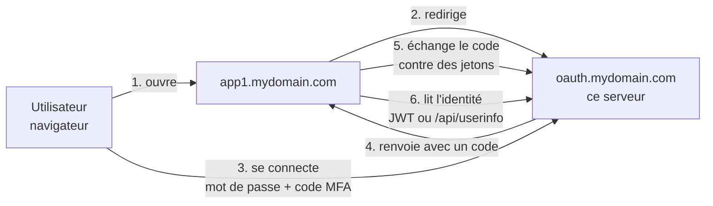
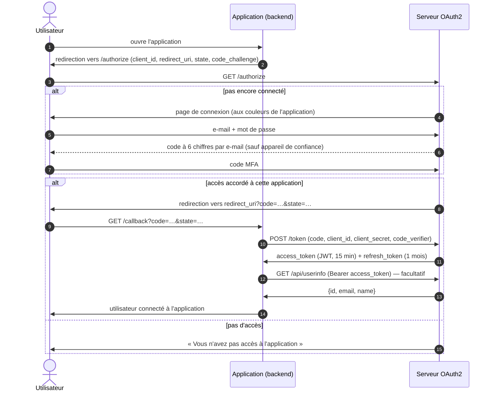

# Fonctionnement

← [Documentation](README.md)

## Vue d'ensemble

Le serveur est un **fournisseur d'identité** : il gère les comptes, la connexion et les accès, et prouve aux
applications qui est l'utilisateur. Les applications n'ont jamais connaissance du mot de passe.



Protocole : **OAuth 2.0**, flux *Authorization Code* (avec PKCE) et *Refresh Token*, implémenté avec
[league/oauth2-server](https://oauth2.thephpleague.com/). Les jetons d'accès sont des **JWT signés RS256**.

## Un compte unique pour toutes les applications

- Une personne = **un compte**, identifié par son adresse e-mail, valable pour toutes les applications.
- Une fois connecté sur `oauth.mydomain.com`, l'utilisateur passe d'une application à l'autre **sans ressaisir
  son mot de passe** (SSO) : le serveur reconnaît sa session et renvoie directement vers l'application.
- **Inscription** depuis une application : si l'adresse existe déjà (compte créé depuis une autre application),
  la personne est redirigée vers la connexion avec le message *« Vous êtes déjà inscrit avec cette adresse
  e-mail. Le même compte sert pour toutes les applications : connectez-vous. »*
- Le **portail** (`https://oauth.mydomain.com/`) liste les applications auxquelles l'utilisateur a accès.

## Contrôle d'accès par application

Être connecté ne suffit pas : l'administrateur **attribue** des applications à chaque utilisateur.

| Situation | Résultat |
|---|---|
| L'utilisateur a accès à l'application | Il est renvoyé vers l'application, connecté. |
| Il n'y a pas accès | Page *« Vous n'avez pas accès à l'application X »* ; l'application ne reçoit rien. |
| L'application est désactivée | Page *« L'application X est momentanément désactivée »*. |
| Le compte est bloqué | Connexion impossible. |

**Inscription ouverte** (option par application) : une personne qui crée son compte *depuis* cette application
y a accès immédiatement. Sinon (par défaut), le compte est créé mais un administrateur doit attribuer l'accès.

Retirer un accès, bloquer un compte ou désactiver une application **rend les jetons concernés inutilisables** :
`/api/userinfo` et le renouvellement des jetons sont refusés immédiatement ; une application qui se contente de
vérifier la signature du JWT localement perd l'accès au plus tard à son expiration (15 min).

## Le parcours de connexion en détail



Il n'y a **pas d'écran de consentement** (« l'application X veut accéder à… ») : les applications sont les vôtres
(*first-party*) et c'est l'administrateur qui décide des accès.

## Les jetons

| Jeton | Durée | Rôle |
|---|---|---|
| Code d'autorisation | 10 min, usage unique | Remis à l'application dans l'URL de retour, échangé contre les jetons. |
| Access token (JWT) | 15 min (`OAUTH_ACCESS_TOKEN_TTL`) | Prouve l'identité : contient `uid`, `email`, `name`, `aud` (client ID). |
| Refresh token | 1 mois | Obtient un nouvel access token. **Remplacé à chaque utilisation** (rotation). |

Les jetons sont signés avec la **clé privée RSA** du serveur (générée au premier démarrage, stockée dans le volume
`oauth_keys`). Les applications peuvent vérifier la signature avec la **clé publique**, sans appeler le serveur.
Les codes et refresh tokens sont en plus chiffrés avec `OAUTH_ENCRYPTION_KEY`.

## Double authentification (MFA) par e-mail

Après le mot de passe, un **code à 6 chiffres** est envoyé par e-mail (valable 10 minutes, à usage unique).
L'utilisateur peut cocher **« Faire confiance à cet appareil »** (coché par défaut) : ce navigateur ne demandera
plus de code pendant 30 jours (`MFA_TRUSTED_DEVICE_LIFETIME`).

Un nouveau code est exigé :
- sur un nouvel appareil ou navigateur, ou à l'expiration de la période de confiance ;
- après un changement de mot de passe (« mot de passe oublié » ou modification par l'administrateur) ;
- après un « Déconnecter partout » ou un blocage.

À l'inscription, ce code sert aussi à **vérifier l'adresse e-mail**.

Protections : 5 essais de code par quart d'heure (par compte, quelle que soit l'adresse IP), après quoi le code
est invalidé ; 3 renvois de code par quart d'heure. La MFA peut être désactivée globalement (`MFA_ENABLED=0`).

## Mot de passe oublié

1. Lien **« Mot de passe oublié ? »** sur la page de connexion ; l'utilisateur saisit son e-mail. La réponse est
   toujours la même, que le compte existe ou non (rien n'est révélé, rien n'est envoyé à un compte bloqué).
2. Il reçoit un lien valable **1 heure**, utilisable **une seule fois**. Un e-mail par compte toutes les
   15 minutes au plus, 5 demandes par quart d'heure par adresse IP.
3. Il choisit un nouveau mot de passe (10 caractères minimum). **Toutes ses sessions sont fermées**, ses appareils de
   confiance oubliés et ses jetons révoqués ; il se reconnecte avec le nouveau mot de passe et un code MFA.
4. S'il venait d'une application, il y est renvoyé (si le lien est ouvert dans le même navigateur).

Durées réglables dans `config/packages/reset_password.yaml`.

## Déconnexion

- **Depuis une application** : elle redirige vers `/logout?redirect_uri=https://app1.mydomain.com/`. La session du
  serveur est fermée (l'utilisateur devra se reconnecter pour toutes les applications), puis il revient sur
  l'application. Seules les adresses des applications déclarées sont acceptées (pas de redirection ouverte).
- **Par l'administrateur** : « Déconnecter partout » ferme toutes les sessions, oublie les appareils de confiance
  et révoque tous les jetons ; « Bloquer » fait de même et désactive le compte. Voir [Administration](administration.md#révoquer-un-utilisateur).

## Personnalisation par application

Chaque application peut avoir son **logo**, sa **couleur principale**, sa **couleur de fond** et un **message
d'accueil**. Ils s'appliquent aux pages de connexion, d'inscription et « accès refusé » quand l'utilisateur
arrive depuis cette application (le serveur la reconnaît au `client_id` de la demande `/authorize`).

## Sécurité

- Mots de passe hachés (algorithme `auto` : bcrypt/argon2), 10 caractères minimum ; secrets d'application hachés
  (affichés une seule fois).
- Limitation des tentatives : connexion et code MFA (5 / 15 min), inscriptions (5 / h par IP), mot de passe oublié.
- Protection CSRF sur tous les formulaires ; cookies de session `HttpOnly`, `SameSite=Lax`, `Secure` en HTTPS.
- En-têtes de sécurité : `Content-Security-Policy`, `X-Frame-Options: DENY`, `X-Content-Type-Options`,
  `Referrer-Policy` ; HSTS ajouté par le reverse proxy (Caddy).
- Redirect URIs vérifiées strictement ; PKCE obligatoire pour les clients publics ; refresh tokens à usage unique.
- Logos : images uniquement (SVG refusé, il peut contenir du script).
- Image Docker de production sans outils de compilation, code en lecture seule, utilisateur non-root.

## Architecture technique

| Élément | Choix |
|---|---|
| Langage, framework | PHP 8.4, Symfony 7.4 LTS |
| Base de données | PostgreSQL 16 (Doctrine ORM, migrations) |
| OAuth2 | league/oauth2-server-bundle |
| MFA | scheb/2fa-bundle (code e-mail, appareils de confiance) |
| Administration | EasyAdmin 5 (`/admin`) |
| E-mails | Symfony Mailer, Brevo en production, Mailpit en développement |
| Serveur web | FrankenPHP (Caddy + PHP) en **mode worker** : l'application reste chargée en mémoire |
| Déploiement | Docker Compose, Caddy sur la machine hôte pour le HTTPS |

```
Internet ──HTTPS──▶ Caddy (machine hôte, certificats Let's Encrypt)
                      │  reverse_proxy 127.0.0.1:8080
                      ▼
                 ┌──────────── docker compose ─────────────┐
                 │  php       FrankenPHP (Caddy + PHP 8.4)  │
                 │            mode worker, utilisateur app  │
                 │     │                                     │
                 │  database  PostgreSQL 16                 │
                 └──────────────────────────────────────────┘
   volumes : database_data · oauth_keys (clés RSA) · oauth_uploads (logos) · caddy_data/config
```

### Organisation du code

| Dossier | Contenu |
|---|---|
| `src/Entity` | `User` (compte, accès, MFA), `Application` (client OAuth2 + personnalisation) |
| `src/Controller` | Connexion, inscription, MFA, mot de passe oublié, portail, `/api/userinfo`, administration |
| `src/EventSubscriber` | Contrôle d'accès à `/authorize`, claims du JWT, déconnexion, en-têtes de sécurité, sessions |
| `src/Security`, `src/Service` | MFA, révocation des sessions et des jetons |
| `src/Command` | Commandes `app:*` (utilisateurs, applications, accès) |
| `templates/` | Pages (Twig) et e-mails |
| `tests/` | Tests fonctionnels (PHPUnit) et test de bout en bout (`tests/e2e`) |
| `examples/demo-client` | Application de démonstration (client OAuth2 minimal) |
| `frankenphp/`, `Dockerfile`, `compose*.yaml` | Image et environnements Docker |
| `deploy/caddy` | Configuration Caddy de la machine hôte |
