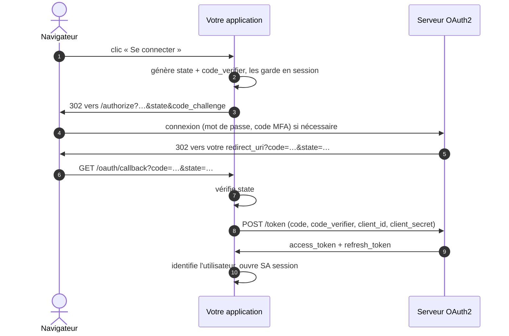

# Intégrer une application

← [Documentation](README.md)

Ce guide s'adresse au **développeur d'une application** qui veut déléguer la connexion de ses utilisateurs au
serveur (`https://oauth.mydomain.com` dans les exemples). Il ne suppose aucune connaissance préalable d'OAuth2.

Le serveur parle **OAuth 2.0** standard (flux *Authorization Code* avec PKCE, *Refresh Token*) : toute
bibliothèque OAuth2 générique convient.

## Sommaire

1. [Ce qu'il vous faut](#1-ce-quil-vous-faut)
2. [Paramètres du serveur](#2-paramètres-du-serveur)
3. [Le flux de connexion, pas à pas](#3-le-flux-de-connexion-pas-à-pas)
4. [Identifier l'utilisateur](#4-identifier-lutilisateur)
5. [Garder l'utilisateur connecté : session et renouvellement](#5-garder-lutilisateur-connecté--session-et-renouvellement)
6. [Déconnexion](#6-déconnexion)
7. [Exemples de code](#7-exemples-de-code) : PHP, Symfony, Node.js, **Nuxt (SSR)**, Python, Grafana
8. [Tester son intégration](#8-tester-son-intégration)
9. [Erreurs fréquentes](#9-erreurs-fréquentes)
10. [Liste de contrôle avant la mise en production](#10-liste-de-contrôle-avant-la-mise-en-production)

## 1. Ce qu'il vous faut

Demandez à l'administrateur du serveur de **déclarer votre application** (voir [Administration](administration.md#déclarer-une-application)).
Indiquez-lui :

- le **nom** de l'application et son **URL** (ex. `https://app1.mydomain.com/`) ;
- la ou les **redirect URIs** (callback) : l'URL de votre application qui recevra l'utilisateur après connexion,
  ex. `https://app1.mydomain.com/oauth/callback` (et `http://localhost:3000/oauth/callback` pour le développement) ;
- le **type de client** :

| Votre application | Type | Ce que vous recevez |
|---|---|---|
| Site ou API avec un **backend** (PHP, Node, Python, Java…) — cas le plus courant | **Confidentiel** | client ID + **client secret** |
| Application **mobile** ou **de bureau** (le code est chez l'utilisateur) | **Public** | client ID seul ; **PKCE obligatoire** |
| Application JavaScript **avec rendu serveur** (Nuxt SSR, Next.js, SvelteKit, Remix…) | **Confidentiel** | client ID + **client secret**, utilisés uniquement par la partie serveur. Voir l'[exemple Nuxt](#nuxt-ssr). |
| Application **JavaScript sans backend** (SPA pure, site statique) | — | Pas encore possible directement (le serveur n'envoie pas d'en-têtes CORS). Ajoutez un petit backend (*BFF*) en client confidentiel — un framework avec rendu serveur comme Nuxt fait exactement cela. |

Vous recevez un **client ID** (ex. `app1`) et, pour un client confidentiel, un **client secret**. Le secret est
affiché une seule fois à l'administrateur : conservez-le comme un mot de passe (variable d'environnement, coffre à
secrets), **jamais** dans le code source ni côté navigateur.

L'administrateur doit aussi **vous donner accès** à l'application (ou cocher *Inscription ouverte*) : sinon,
même connecté, vous verrez « Vous n'avez pas accès à l'application ».

## 2. Paramètres du serveur

| Paramètre | Valeur |
|---|---|
| Authorization endpoint | `https://oauth.mydomain.com/authorize` |
| Token endpoint | `https://oauth.mydomain.com/token` |
| User info endpoint | `https://oauth.mydomain.com/api/userinfo` |
| Logout | `https://oauth.mydomain.com/logout?redirect_uri=<URL de votre application>` |
| Scopes | `profile email` (séparés par un espace) |
| Grant types | `authorization_code`, `refresh_token` |
| PKCE | `S256` ; obligatoire pour les clients publics, recommandé pour tous |
| Authentification du client sur `/token` | `client_id` + `client_secret` dans le corps (`client_secret_post`) ou en HTTP Basic (`client_secret_basic`) |
| Access token | JWT signé **RS256**, valable **15 minutes** |
| Refresh token | valable **1 mois**, **à usage unique** (un nouveau est fourni à chaque renouvellement) |
| Clé publique (vérification des JWT) | fournie par l'administrateur (`make prod-public-key`) |

Il n'y a pas (encore) de découverte OpenID Connect (`/.well-known/openid-configuration`) ni d'`id_token` : configurez
les URL ci-dessus à la main. Voir la [feuille de route](../ROADMAP.md).

## 3. Le flux de connexion, pas à pas



### 3.1 Rediriger l'utilisateur vers le serveur

Quand l'utilisateur doit se connecter, votre application génère deux valeurs aléatoires et **les garde dans la
session** de l'utilisateur :

- `state` : protège contre les attaques CSRF (vous vérifierez au retour que c'est le même) ;
- `code_verifier` (PKCE) : une chaîne aléatoire de 43 à 128 caractères ; vous en envoyez l'empreinte
  `code_challenge = BASE64URL(SHA256(code_verifier))`.

Puis elle redirige le navigateur vers :

```
https://oauth.mydomain.com/authorize
    ?response_type=code
    &client_id=app1
    &redirect_uri=https%3A%2F%2Fapp1.mydomain.com%2Foauth%2Fcallback
    &scope=profile%20email
    &state=Rz8Hc1…
    &code_challenge=E9Melhoa2Owv…
    &code_challenge_method=S256
```

| Paramètre | Obligatoire | Valeur |
|---|---|---|
| `response_type` | oui | `code` |
| `client_id` | oui | votre client ID |
| `redirect_uri` | oui | une redirect URI **déclarée**, à l'identique (schéma, domaine, port, chemin) |
| `scope` | non | `profile email` (par défaut) ; `email` seul si vous n'avez pas besoin du nom |
| `state` | recommandé | valeur aléatoire gardée en session |
| `code_challenge`, `code_challenge_method` | public : oui ; confidentiel : recommandé | empreinte du `code_verifier`, `S256` |

Le serveur s'occupe de tout le reste : connexion, inscription, code MFA, mot de passe oublié, contrôle d'accès.
Les pages sont affichées aux couleurs de votre application si l'administrateur les a personnalisées.

> Si l'utilisateur **n'a pas accès** à votre application, il voit une page « Vous n'avez pas accès » sur le
> serveur et **ne revient pas** vers votre application. Rien à gérer de votre côté.

### 3.2 Recevoir l'utilisateur sur la redirect URI

Le serveur renvoie le navigateur vers votre redirect URI :

```
https://app1.mydomain.com/oauth/callback?code=def50200a8f3…&state=Rz8Hc1…
```

Votre application doit :

1. vérifier que `state` est égal à celui gardé en session (sinon : refuser) ;
2. si l'URL contient `error` à la place de `code` (ex. `error=invalid_scope`), afficher une erreur ;
3. échanger le code **immédiatement** (il expire au bout de 10 minutes et ne sert qu'une fois).

### 3.3 Échanger le code contre des jetons

Depuis votre **backend** (jamais depuis le navigateur pour un client confidentiel) :

```bash
curl -X POST https://oauth.mydomain.com/token \
  -d grant_type=authorization_code \
  -d client_id=app1 \
  -d client_secret=VOTRE_SECRET \
  -d redirect_uri=https://app1.mydomain.com/oauth/callback \
  -d code=def50200a8f3… \
  -d code_verifier=LE_CODE_VERIFIER_GARDÉ_EN_SESSION
```

Pour un client public, omettez `client_secret` (le `code_verifier` est alors obligatoire).

Réponse :

```json
{
  "token_type": "Bearer",
  "expires_in": 900,
  "access_token": "eyJ0eXAiOiJKV1QiLCJhbGciOiJSUzI1NiJ9.eyJ1aWQiOjQyLCJlbWFpbCI6…",
  "refresh_token": "def50200b1c7…"
}
```

Conservez les jetons **côté serveur** (session de votre application, base de données chiffrée), pas dans le
`localStorage` du navigateur.

## 4. Identifier l'utilisateur

Deux méthodes, combinables.

### A. Appeler `/api/userinfo` (le plus simple)

```bash
curl -H "Authorization: Bearer <access_token>" https://oauth.mydomain.com/api/userinfo
```

```json
{ "sub": "alice@mydomain.com", "id": 42, "name": "Alice Martin", "email": "alice@mydomain.com" }
```

| Champ | Présent si | Description |
|---|---|---|
| `id` | toujours | **Identifiant stable** de l'utilisateur (entier). À utiliser comme clé dans votre base. |
| `sub` | toujours | Identifiant de connexion (l'e-mail). Peut changer. |
| `email` | scope `email` | Adresse e-mail (vérifiée). |
| `name` | scope `profile` | Nom affiché. |

Réponses d'erreur : **401** si le jeton est invalide, expiré ou révoqué (accès retiré, compte bloqué…) ; **403** si
votre application a été désactivée ou que l'utilisateur n'y a plus accès. Dans les deux cas : considérez l'utilisateur comme déconnecté.

Avantage : chaque appel vérifie l'état **actuel** (accès retiré, compte bloqué → refus immédiat).

### B. Vérifier le JWT localement (sans appel réseau)

L'access token est un JWT signé avec la clé privée du serveur. Avec la **clé publique** (fichier PEM transmis par
l'administrateur), votre application peut le vérifier elle-même. Contenu (*claims*) :

```json
{
  "aud": ["app1"],
  "jti": "5d1c…",
  "iat": 1790812800, "nbf": 1790812800, "exp": 1790813700,
  "sub": "alice@mydomain.com",
  "scopes": ["profile", "email"],
  "uid": 42,
  "email": "alice@mydomain.com",
  "name": "Alice Martin"
}
```

Vérifiez **toujours** : la signature (algorithme `RS256` uniquement), `exp` (expiration), et que `aud` contient
**votre** client ID (un jeton émis pour une autre application ne doit pas être accepté). Utilisez une bibliothèque
reconnue : `firebase/php-jwt` ou `lcobucci/jwt` (PHP), `jose` (Node.js), `PyJWT` (Python).

Limite : un JWT reste valable jusqu'à son expiration (15 min) même si l'accès est retiré entre-temps. Si c'est
gênant, appelez `/api/userinfo` pour les actions sensibles, ou au renouvellement.

### Faire le lien avec vos comptes existants

Au premier passage, rattachez l'utilisateur par son `id` (colonne `sso_id` par exemple). Si votre application a
déjà des comptes, vous pouvez faire le lien **une fois** par l'adresse e-mail (vérifiée par le serveur), puis
n'utiliser que l'`id` : l'e-mail peut être modifié par l'administrateur.

## 5. Garder l'utilisateur connecté : session et renouvellement

Après le callback, **ouvrez votre propre session** (cookie de votre application) : l'utilisateur ne repasse pas par
le serveur à chaque page.

Si vous avez besoin de l'access token au-delà de 15 minutes (appels à `/api/userinfo`, à une API…), renouvelez-le
avec le refresh token :

```bash
curl -X POST https://oauth.mydomain.com/token \
  -d grant_type=refresh_token \
  -d client_id=app1 \
  -d client_secret=VOTRE_SECRET \
  -d refresh_token=def50200b1c7…
```

La réponse contient un **nouvel access token et un nouveau refresh token** : **remplacez les deux**. L'ancien
refresh token ne fonctionne plus (rotation, ce qui limite les dégâts en cas de vol).

Si le renouvellement échoue (`400 invalid_grant` : refresh token expiré ou révoqué, accès retiré, compte bloqué,
« déconnecter partout »), **fermez la session locale** et renvoyez l'utilisateur vers la connexion.

Stratégie simple et sûre : à chaque requête, si l'access token a expiré, le renouveler ; en cas d'échec,
déconnecter. Vous respectez ainsi les révocations faites par l'administrateur sous 15 minutes au plus.

Si l'utilisateur revient après la fin de votre session, redirigez-le simplement vers `/authorize` : s'il est
encore connecté sur le serveur, il revient aussitôt sans rien saisir (SSO).

## 6. Déconnexion

Le bouton « Se déconnecter » de votre application doit :

1. détruire la session locale (et oublier les jetons) ;
2. rediriger vers `https://oauth.mydomain.com/logout?redirect_uri=https://app1.mydomain.com/`.

Le serveur ferme sa session (l'utilisateur est déconnecté de **toutes** les applications au prochain passage par
le serveur) puis renvoie vers `redirect_uri`. Cette adresse doit avoir la même origine (schéma + domaine + port)
que l'URL de l'application ou l'une de ses redirect URIs déclarées ; sinon l'utilisateur reste sur la page de
connexion du serveur.

## 7. Exemples de code

### PHP sans dépendance

L'[application de démonstration](../examples/demo-client/index.php) est un client complet en un seul fichier
commenté (~250 lignes) : state, PKCE, échange du code, `/api/userinfo`, vérification du JWT, renouvellement et
déconnexion. C'est le meilleur point de départ pour comprendre, ou pour un petit site.

### PHP avec league/oauth2-client

```bash
composer require league/oauth2-client
```

```php
use League\OAuth2\Client\Provider\AbstractProvider;
use League\OAuth2\Client\Provider\GenericProvider;

$provider = new GenericProvider([
    'clientId'                => getenv('OAUTH_CLIENT_ID'),
    'clientSecret'            => getenv('OAUTH_CLIENT_SECRET'),
    'redirectUri'             => 'https://app1.mydomain.com/oauth/callback',
    'urlAuthorize'            => 'https://oauth.mydomain.com/authorize',
    'urlAccessToken'          => 'https://oauth.mydomain.com/token',
    'urlResourceOwnerDetails' => 'https://oauth.mydomain.com/api/userinfo',
    'scopes'                  => ['profile', 'email'],
    'scopeSeparator'          => ' ',
    'pkceMethod'              => AbstractProvider::PKCE_METHOD_S256,
]);

// /login
$url = $provider->getAuthorizationUrl();
$_SESSION['oauth_state'] = $provider->getState();
$_SESSION['oauth_pkce'] = $provider->getPkceCode();
header('Location: '.$url);
exit;

// /oauth/callback
if (empty($_GET['state']) || $_GET['state'] !== ($_SESSION['oauth_state'] ?? null)) {
    exit('State invalide');
}
$provider->setPkceCode($_SESSION['oauth_pkce']);
$token = $provider->getAccessToken('authorization_code', ['code' => $_GET['code']]);
$user = $provider->getResourceOwner($token)->toArray();   // ['id' => 42, 'email' => …, 'name' => …]

$_SESSION['user_id'] = $user['id'];
$_SESSION['token'] = $token->jsonSerialize();             // access + refresh token

// Plus tard : renouvellement
$token = new \League\OAuth2\Client\Token\AccessToken($_SESSION['token']);
if ($token->hasExpired()) {
    $token = $provider->getAccessToken('refresh_token', ['refresh_token' => $token->getRefreshToken()]);
    $_SESSION['token'] = $token->jsonSerialize();
}
```

### Symfony avec knpuniversity/oauth2-client-bundle

```bash
composer require knpuniversity/oauth2-client-bundle league/oauth2-client
```

```yaml
# config/packages/knpu_oauth2_client.yaml
knpu_oauth2_client:
    clients:
        sso:
            type: generic
            provider_class: League\OAuth2\Client\Provider\GenericProvider
            client_id: '%env(OAUTH_CLIENT_ID)%'
            client_secret: '%env(OAUTH_CLIENT_SECRET)%'
            redirect_route: oauth_check
            redirect_params: {}
            provider_options:
                urlAuthorize: 'https://oauth.mydomain.com/authorize'
                urlAccessToken: 'https://oauth.mydomain.com/token'
                urlResourceOwnerDetails: 'https://oauth.mydomain.com/api/userinfo'
                scopeSeparator: ' '
```

```php
#[Route('/oauth/login', name: 'oauth_start')]
public function start(ClientRegistry $clients): Response
{
    return $clients->getClient('sso')->redirect(['profile', 'email'], []);
}

#[Route('/oauth/callback', name: 'oauth_check')]
public function check(): Response
{
    // Intercepté par votre authenticator (voir ci-dessous)
}
```

Créez un authenticator qui étend `KnpU\OAuth2ClientBundle\Security\Authenticator\OAuth2Authenticator` :
`supports()` répond vrai pour la route `oauth_check` ; `authenticate()` appelle
`$client->getAccessToken()` puis `$client->fetchUserFromToken($token)->toArray()` et retrouve (ou crée)
l'utilisateur local par son `id`. Le bundle gère le `state`. Documentation :
<https://github.com/knpuniversity/oauth2-client-bundle#authenticating-with-the-new-symfony-authenticator>.

### Node.js (Express, sans bibliothèque OAuth)

```js
import express from 'express';
import session from 'express-session';
import crypto from 'node:crypto';

const SERVER = 'https://oauth.mydomain.com';
const CLIENT_ID = process.env.OAUTH_CLIENT_ID;
const CLIENT_SECRET = process.env.OAUTH_CLIENT_SECRET;
const REDIRECT_URI = 'https://app1.mydomain.com/oauth/callback';
const b64url = (buf) => buf.toString('base64url');

const app = express();
app.use(session({ secret: process.env.SESSION_SECRET, resave: false, saveUninitialized: false,
                  cookie: { httpOnly: true, secure: true, sameSite: 'lax' } }));

app.get('/login', (req, res) => {
  req.session.state = b64url(crypto.randomBytes(16));
  req.session.verifier = b64url(crypto.randomBytes(48));
  const params = new URLSearchParams({
    response_type: 'code', client_id: CLIENT_ID, redirect_uri: REDIRECT_URI, scope: 'profile email',
    state: req.session.state,
    code_challenge: b64url(crypto.createHash('sha256').update(req.session.verifier).digest()),
    code_challenge_method: 'S256',
  });
  res.redirect(`${SERVER}/authorize?${params}`);
});

app.get('/oauth/callback', async (req, res) => {
  if (!req.query.state || req.query.state !== req.session.state) return res.status(400).send('State invalide');
  const tokenRes = await fetch(`${SERVER}/token`, {
    method: 'POST',
    body: new URLSearchParams({
      grant_type: 'authorization_code', client_id: CLIENT_ID, client_secret: CLIENT_SECRET,
      redirect_uri: REDIRECT_URI, code: req.query.code, code_verifier: req.session.verifier,
    }),
  });
  if (!tokenRes.ok) return res.status(401).send('Connexion refusée');
  const tokens = await tokenRes.json();
  const user = await (await fetch(`${SERVER}/api/userinfo`, {
    headers: { Authorization: `Bearer ${tokens.access_token}` },
  })).json();
  req.session.regenerate(() => {
    req.session.user = user;        // { id, email, name, sub }
    req.session.tokens = tokens;
    res.redirect('/');
  });
});

app.get('/logout', (req, res) => {
  req.session.destroy(() => res.redirect(`${SERVER}/logout?redirect_uri=${encodeURIComponent('https://app1.mydomain.com/')}`));
});
```

Pour vérifier le JWT localement : bibliothèque [`jose`](https://github.com/panva/jose)
(`importSPKI(pem, 'RS256')` puis `jwtVerify(token, key, { audience: CLIENT_ID, algorithms: ['RS256'] })`).

### Nuxt (SSR)

Une application **Nuxt avec rendu serveur** est un client confidentiel : le serveur Nitro de Nuxt échange le code,
garde le client secret et les jetons ; le navigateur ne reçoit qu'un cookie de session chiffré (`httpOnly`). Les
pages Vue appellent vos routes `server/api/…`, qui ajoutent l'access token : c'est le modèle *BFF*, recommandé pour
les applications navigateur.

Exemple complet et testé : [`examples/nuxt-client`](../examples/nuxt-client) (Nuxt 4,
[nuxt-auth-utils](https://github.com/atinux/nuxt-auth-utils) pour la session).

| Fonctionne | Ne fonctionne pas |
|---|---|
| `nuxt build` déployé avec son serveur Node (ou Bun, Deno, edge : le code n'utilise que Web Crypto) | `nuxt generate` / `ssr: false` sans serveur : rien pour garder le secret ni appeler `/token` |
| Appels à `/token` et `/api/userinfo` depuis `server/` | Appels à `/token` depuis le code Vue (bloqués par CORS, et le secret serait exposé) |

Configuration (côté serveur uniquement : surtout pas dans `runtimeConfig.public`) :

```ts
// nuxt.config.ts
export default defineNuxtConfig({
  compatibilityDate: '2025-07-15',
  modules: ['nuxt-auth-utils'],
  runtimeConfig: {
    // Côté serveur uniquement (jamais envoyé au navigateur). Valeurs surchargées par les variables
    // d'environnement NUXT_OAUTH_SERVER_URL, NUXT_OAUTH_CLIENT_ID, NUXT_OAUTH_CLIENT_SECRET, NUXT_OAUTH_REDIRECT_URI.
    oauth: {
      serverUrl: 'https://oauth.mydomain.com',
      clientId: '',
      clientSecret: '',
      redirectUri: 'https://app1.mydomain.com/auth/callback',
    },
  },
})
```

```dotenv
NUXT_OAUTH_SERVER_URL=https://oauth.mydomain.com
NUXT_OAUTH_CLIENT_ID=app1
NUXT_OAUTH_CLIENT_SECRET=…
NUXT_OAUTH_REDIRECT_URI=https://app1.mydomain.com/auth/callback
NUXT_SESSION_PASSWORD=…            # 32 caractères minimum : openssl rand -hex 32
```

**Connexion** — redirection vers le serveur avec state et PKCE, en mémorisant la page à rouvrir :

```ts
// server/routes/auth/login.get.ts
// 1. Redirection vers le serveur OAuth2, avec state (anti-CSRF) et PKCE
export default defineEventHandler(async (event) => {
  const { serverUrl, clientId, redirectUri } = useRuntimeConfig(event).oauth
  const state = randomString(16)
  const verifier = randomString(48)

  // Page à rouvrir après connexion (chemin relatif uniquement : pas de redirection ouverte)
  const target = String(getQuery(event).redirect ?? '/')
  const returnTo = target.startsWith('/') && !target.startsWith('//') ? target : '/'

  // Valeurs temporaires (10 min), lues au retour sur /auth/callback
  const cookie = { httpOnly: true, secure: true, sameSite: 'lax' as const, path: '/auth', maxAge: 600 }
  setCookie(event, 'oauth_state', state, cookie)
  setCookie(event, 'oauth_verifier', verifier, cookie)
  setCookie(event, 'oauth_return_to', returnTo, cookie)

  return sendRedirect(event, `${serverUrl}/authorize?${new URLSearchParams({
    response_type: 'code',
    client_id: clientId,
    redirect_uri: redirectUri,
    scope: 'profile email',
    state,
    code_challenge: await pkceChallenge(verifier),
    code_challenge_method: 'S256',
  })}`)
})
```

**Retour du serveur** — vérification du state, échange du code, ouverture de la session. Le champ `secure` de la
session n'est jamais envoyé au navigateur :

```ts
// server/routes/auth/callback.get.ts
// 2. Retour du serveur OAuth2 : vérification du state, échange du code, ouverture de la session
export default defineEventHandler(async (event) => {
  const { redirectUri } = useRuntimeConfig(event).oauth
  const query = getQuery(event)
  const state = getCookie(event, 'oauth_state')
  const verifier = getCookie(event, 'oauth_verifier')
  const returnTo = getCookie(event, 'oauth_return_to') ?? '/'
  for (const name of ['oauth_state', 'oauth_verifier', 'oauth_return_to']) {
    deleteCookie(event, name, { path: '/auth' })
  }

  if (query.error) {
    throw createError({ statusCode: 400, message: `Connexion refusée : ${query.error}` })
  }
  if (!state || !verifier || query.state !== state) {
    throw createError({ statusCode: 400, message: 'State invalide, recommencez la connexion' })
  }

  const tokens = await requestTokens(event, {
    grant_type: 'authorization_code',
    redirect_uri: redirectUri,
    code: String(query.code ?? ''),
    code_verifier: verifier,
  }).catch(() => {
    throw createError({ statusCode: 401, message: 'Code refusé, recommencez la connexion' })
  })
  const userinfo = await fetchUserinfo(event, tokens.access_token)

  // Identifiez l'utilisateur par userinfo.id (stable) ; créez ou mettez à jour votre compte local ici.
  await replaceUserSession(event, {
    user: { id: userinfo.id, email: userinfo.email, name: userinfo.name },
    secure: tokensForSession(tokens),
  })

  return sendRedirect(event, returnTo)
})
```

**Renouvellement des jetons** — `getAccessToken(event)` renvoie un access token valide et le renouvelle quand il
arrive à expiration (`server/utils/oauth.ts`, extrait) :

```ts
// Renouvellements en cours, par refresh token : deux requêtes simultanées partagent le même appel
// (le refresh token n'est utilisable qu'une fois ; un second appel échouerait et déconnecterait l'utilisateur).
const pendingRefreshes = new Map<string, Promise<OAuthTokens>>()

/**
 * Access token valide pour la session courante, renouvelé s'il arrive à expiration.
 * Si le renouvellement est refusé (accès retiré, compte bloqué, « déconnecter partout »…),
 * la session est fermée et une erreur 401 est renvoyée.
 */
export async function getAccessToken(event: H3Event): Promise<string> {
  const { secure } = await requireUserSession(event)
  if (!secure) {
    throw createError({ statusCode: 401, message: 'Session invalide' })
  }
  if (Date.now() < secure.refreshAt) {
    return secure.accessToken
  }

  let refresh = pendingRefreshes.get(secure.refreshToken)
  if (!refresh) {
    refresh = requestTokens(event, { grant_type: 'refresh_token', refresh_token: secure.refreshToken })
      .finally(() => setTimeout(() => pendingRefreshes.delete(secure.refreshToken), 10_000))
    pendingRefreshes.set(secure.refreshToken, refresh)
  }

  try {
    const tokens = await refresh
    // Rotation : on enregistre le NOUVEAU refresh token
    await setUserSession(event, { secure: tokensForSession(tokens) })
    return tokens.access_token
  }
  catch {
    await clearUserSession(event)
    throw createError({ statusCode: 401, message: 'Session expirée, reconnectez-vous' })
  }
}
```

```ts
// server/api/me.get.ts — API protégée appelée par les pages
// Exemple d'API protégée : utilise l'access token (renouvelé si besoin) pour appeler /api/userinfo.
// Une réponse 401/403 signifie que l'accès a été retiré : on ferme la session.
export default defineEventHandler(async (event) => {
  const accessToken = await getAccessToken(event)

  try {
    return await fetchUserinfo(event, accessToken)
  }
  catch {
    await clearUserSession(event)
    throw createError({ statusCode: 401, message: 'Accès retiré, reconnectez-vous' })
  }
})
```

**Pages protégées** — middleware de route, puis `definePageMeta({ middleware: 'auth' })` dans la page :

```ts
// app/middleware/auth.ts
// Pages protégées : definePageMeta({ middleware: 'auth' })
export default defineNuxtRouteMiddleware((to) => {
  const { loggedIn } = useUserSession()
  if (!loggedIn.value) {
    return navigateTo(`/auth/login?redirect=${encodeURIComponent(to.fullPath)}`, { external: true })
  }
})
```

Côté Vue, `useUserSession()` fournit `loggedIn` et `user` ; `useFetch('/api/me')` appelle l'API protégée.

**Déconnexion** :

```ts
// server/routes/auth/logout.get.ts
// 3. Déconnexion locale puis globale (le serveur OAuth2 ferme sa session et renvoie vers l'application)
export default defineEventHandler(async (event) => {
  const { serverUrl, redirectUri } = useRuntimeConfig(event).oauth
  await clearUserSession(event)

  const home = `${new URL(redirectUri).origin}/`
  return sendRedirect(event, `${serverUrl}/logout?redirect_uri=${encodeURIComponent(home)}`)
})
```

#### Deux pièges propres au rendu serveur (gérés par l'exemple)

1. **Le cookie renouvelé pendant le rendu serveur est perdu.** Un `useFetch('/api/…')` exécuté pendant le rendu
   est un appel *interne* : si cet appel renouvelle les jetons, son nouveau cookie de session n'est **pas** renvoyé
   au navigateur, qui garde l'ancien refresh token, déjà consommé. Résultat : l'utilisateur est déconnecté au
   renouvellement suivant. Solution : renouveler dans un **middleware serveur**, sur la requête de la page
   elle-même, avant le rendu :

   ```ts
   // server/middleware/oauth-refresh.ts
   /**
    * Renouvelle les jetons au début de chaque requête (page ou API) si l'access token expire bientôt.
    *
    * Indispensable avec le rendu serveur : un useFetch('/api/…') exécuté pendant le rendu est un appel
    * interne, dont le cookie de session mis à jour n'est PAS renvoyé au navigateur. Sans ce middleware,
    * le navigateur garderait l'ancien refresh token (déjà consommé) et l'utilisateur serait déconnecté.
    * Ici, le renouvellement a lieu sur la requête de la page elle-même : le nouveau cookie part avec la page,
    * et les appels internes de la même page réutilisent les jetons obtenus (voir pendingRefreshes).
    */
   export default defineEventHandler(async (event) => {
     if (/^\/(auth\/|_nuxt\/|api\/_auth\/|__nuxt)/.test(event.path)) {
       return
     }
     const session = await getUserSession(event)
     if (!session.user || !session.secure) {
       return
     }
     // En cas d'échec (accès retiré, compte bloqué…), la session est fermée : la page s'affiche déconnectée
     await getAccessToken(event).catch(() => {})
   })
   ```

2. **Renouvellements simultanés.** Une page qui lance plusieurs appels en parallèle renouvellerait plusieurs fois
   le même refresh token ; le serveur n'accepte que le premier, et les autres déconnecteraient l'utilisateur.
   `getAccessToken` partage donc un renouvellement en cours entre les requêtes (`pendingRefreshes`). Ce partage est
   propre à chaque processus : si vous faites tourner **plusieurs instances** de l'application, activez l'affinité
   de session sur le répartiteur de charge, ou stockez les jetons dans un stockage partagé (Redis via
   `useStorage()`) avec un verrou.

Testé de bout en bout contre le serveur, avec des access tokens de 20 secondes pour forcer les renouvellements :
page protégée → connexion → retour sur la page demandée, profil rendu côté serveur, aucun jeton dans la page ni dans
la session exposée, renouvellement pendant le rendu serveur puis renouvellements successifs, 5 appels simultanés
(un seul renouvellement), accès retiré (401 et session fermée), SSO, déconnexion globale, protection contre les
redirections ouvertes.

La session tient dans le cookie (≈ 2,5 Ko avec les deux jetons, sous la limite de 4 Ko). Si vous y ajoutez beaucoup
de données, gardez les jetons côté serveur (Redis, base de données) et ne mettez en session qu'un identifiant.

### Python (Flask + Authlib)

```python
from authlib.integrations.flask_client import OAuth
from flask import Flask, redirect, session, url_for
import os

app = Flask(__name__)
app.secret_key = os.environ["SESSION_SECRET"]
oauth = OAuth(app)
oauth.register(
    name="sso",
    client_id=os.environ["OAUTH_CLIENT_ID"],
    client_secret=os.environ["OAUTH_CLIENT_SECRET"],
    authorize_url="https://oauth.mydomain.com/authorize",
    access_token_url="https://oauth.mydomain.com/token",
    api_base_url="https://oauth.mydomain.com/",
    client_kwargs={"scope": "profile email", "code_challenge_method": "S256"},
)

@app.route("/login")
def login():
    return oauth.sso.authorize_redirect(url_for("callback", _external=True))

@app.route("/oauth/callback")
def callback():
    token = oauth.sso.authorize_access_token()          # vérifie state + PKCE
    session["user"] = oauth.sso.get("api/userinfo", token=token).json()
    session["token"] = token
    return redirect("/")

@app.route("/logout")
def logout():
    session.clear()
    return redirect("https://oauth.mydomain.com/logout?redirect_uri=https://app1.mydomain.com/")
```

### Application existante avec « OAuth2 générique » : exemple Grafana

Beaucoup d'applications auto-hébergées acceptent un fournisseur OAuth2 générique. Pour Grafana (`grafana.ini`) :

```ini
[auth.generic_oauth]
enabled = true
name = Mon compte
client_id = grafana
client_secret = VOTRE_SECRET
scopes = profile email
auth_url = https://oauth.mydomain.com/authorize
token_url = https://oauth.mydomain.com/token
api_url = https://oauth.mydomain.com/api/userinfo
email_attribute_path = email
login_attribute_path = email
name_attribute_path = name
use_pkce = true
```

Redirect URI à déclarer : `https://grafana.mydomain.com/login/generic_oauth`. Les applications qui exigent
**OpenID Connect** avec découverte automatique (certaines versions de Nextcloud, Gitea, Proxmox…) ne sont pas
encore compatibles : voir la [feuille de route](../ROADMAP.md).

## 8. Tester son intégration

- **Application de démonstration** : en développement, `make demo email=moi@example.com` puis
  <http://localhost:8081> montre le parcours complet et le contenu des jetons (voir
  [Installation – développement](installation-developpement.md#4-essayer-avec-lapplication-de-démonstration)).
- **Serveur de développement** : déclarez votre application avec une redirect URI `http://localhost:<port>/…`
  sur le serveur de dev (<http://localhost:8080/admin>) ; les e-mails (codes) arrivent dans Mailpit.
- **À la main** : ouvrez l'URL `/authorize` de la section 3.1 dans un navigateur, copiez le `code` de l'URL de retour
  (même si votre application n'existe pas encore), puis échangez-le avec la commande `curl` de la section 3.3
  (dans les 10 minutes).

Cas à vérifier : utilisateur sans accès, accès retiré pendant une session (refus au renouvellement), compte bloqué,
déconnexion depuis votre application puis depuis une autre application.

## 9. Erreurs fréquentes

| Symptôme | Cause | Solution |
|---|---|---|
| `/authorize` répond `401 {"error":"invalid_client"}` | client ID inconnu **ou redirect URI non déclarée** (même une différence de `/` final ou de `http`/`https`) | Comparez caractère par caractère avec la liste de l'admin. |
| Retour sur la redirect URI avec `error=invalid_scope` | scope demandé inconnu | N'utilisez que `profile` et `email`. |
| `/authorize` répond 400 (client public) | `code_challenge` manquant | PKCE obligatoire pour les clients publics. |
| `/token` répond `401 invalid_client` | mauvais client secret, ou application désactivée | Vérifiez le secret (régénéré ?) et le statut de l'application. |
| `/token` répond `400 invalid_request` | `redirect_uri` différente de celle envoyée à `/authorize`, ou paramètre manquant | Envoyez exactement la même `redirect_uri`. |
| `/token` répond `400 invalid_grant` | code expiré (10 min), déjà utilisé, mauvais `code_verifier`, ou refresh token déjà utilisé / révoqué | Recommencez la connexion ; pour le renouvellement, stockez toujours le **nouveau** refresh token. |
| `/api/userinfo` répond 401 | jeton expiré ou révoqué, en-tête `Authorization: Bearer` absent | Renouvelez le jeton, sinon reconnectez l'utilisateur. |
| `/api/userinfo` répond 403 | application désactivée, ou accès de l'utilisateur retiré | Déconnectez l'utilisateur. |
| L'utilisateur voit « Vous n'avez pas accès à l'application » | aucun accès attribué | L'administrateur doit lui donner l'accès (ou activer *Inscription ouverte*). |
| Après déconnexion, l'utilisateur reste sur la page de connexion du serveur | `redirect_uri` de `/logout` hors de l'origine de votre application | Utilisez l'URL de l'application déclarée. |
| State invalide au retour | session de votre application perdue entre l'aller et le retour (cookie `SameSite=Strict`, domaine différent) | Cookie de session en `SameSite=Lax`, même domaine pour `/login` et le callback. |

## 10. Liste de contrôle avant la mise en production

- [ ] HTTPS partout ; redirect URIs de production en `https://`, sans URI de développement.
- [ ] Client secret dans une variable d'environnement ou un coffre à secrets, jamais dans le dépôt ni le navigateur.
- [ ] `state` vérifié au retour ; PKCE (`S256`) activé.
- [ ] Jetons stockés côté serveur ; nouveau refresh token enregistré à chaque renouvellement.
- [ ] Utilisateur identifié par `id` (et non par l'e-mail).
- [ ] Si vérification locale du JWT : signature RS256, `exp` et `aud` vérifiés.
- [ ] Échec de renouvellement ou `/api/userinfo` en 401/403 → déconnexion locale.
- [ ] Bouton de déconnexion qui passe par `/logout?redirect_uri=…`.
- [ ] Session de votre application renouvelée après connexion (protection contre la fixation de session).
